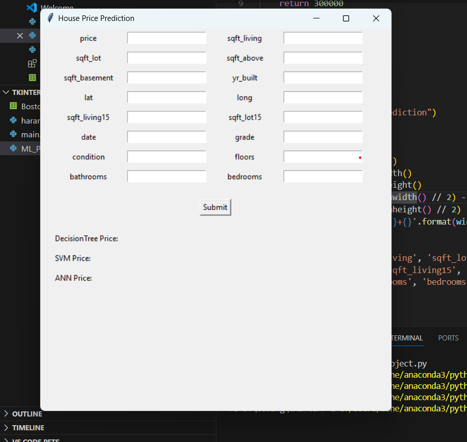

# Advanced Machine Learning Project
--------------------------------------------

 
 
 
 
 
  
   
   
   

this is a project on the Advanced Machine Learning Course section and we focus on applying (Regression and  Classification) Models on real-applied data 

## Focus on:

- develop different 3 models on regression and classification models on 2 different datasets and we will focus on 3 types of models:
    - **Decision tree**
    - **Neural network ( NN )**
    - **Support Vector Machine ( SVM )**
- create a Graphical User Interface (GUI) using **“Tkinter”** to test the model and get the difference between the 3 models in every dataset

- For each model, we should show all these results for your model on testing data (loss curve, accuracy, confusion matrix,..)

## Used Tools & Libraries:

- VS code
- Kaggle
- Python
- Matplotlib library
- NumPy library
- Seaborn library
- scikit-Learn library
- tensorflow
- xgboost

