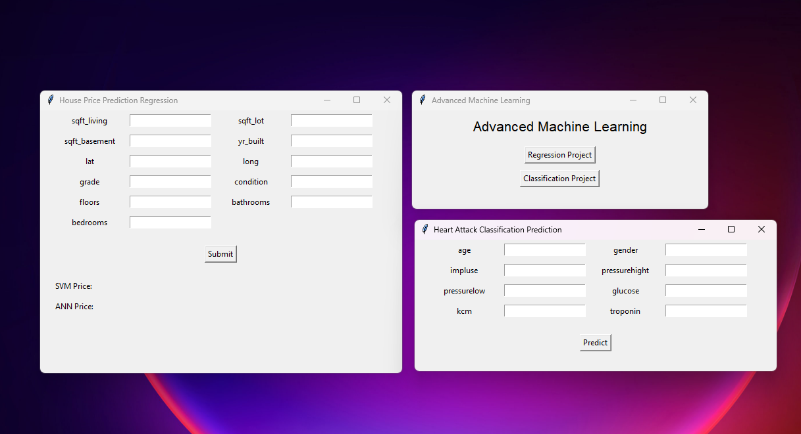
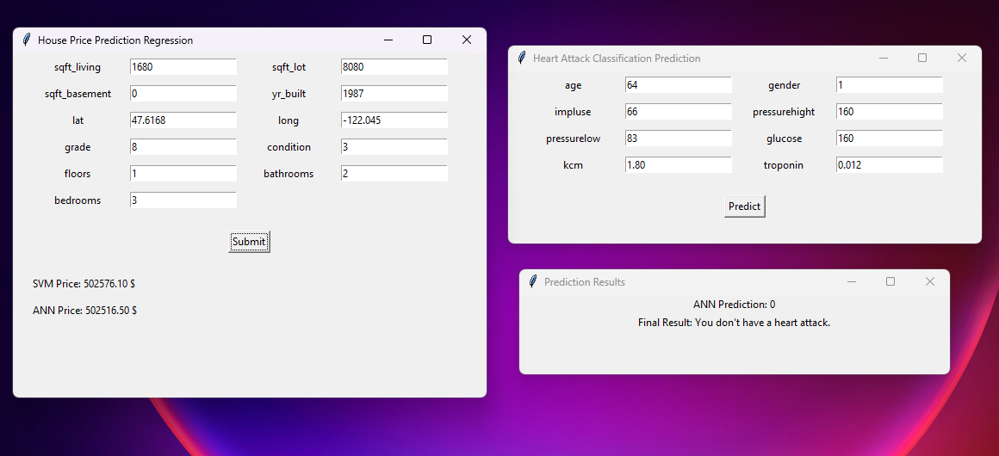

# Machine Learning Application for Classification and Regression (Advanced Machine Learning Course)

## Description
This project applies machine learning algorithms to perform both classification and regression tasks. It focuses on three fundamental models: Support Vector Machines (SVM), Decision Trees, and Artificial Neural Networks (ANN). We have worked on two datasets, with a special emphasis on House Price Prediction for regression tasks, achieving high accuracies above 85%.

## Introduction
The motivation behind this project is to explore the capabilities of machine learning in predicting outcomes with high accuracy. Classification and regression tasks form the core of many machine learning applications, providing insights and predictions based on data.

## Features
- **Implementation** of SVM, Decision Trees, and ANN.
- **Regression Analysis** on the House Price Prediction dataset.
- **Data Preprocessing** to enhance model performance.
- **High Accuracy Rates** achieved (above 85%).
- **GUI Interface** using Tkinter for easy model predictions.

## Installation Instructions
To set up the project environment, please follow next:

Clone the repository: `git clone https://github.com/ABDELHALIM9/Advanced-Machine-Learning-`

## Usage
To run the machine learning models and use the GUI interface:
1. Navigate to the project directory.
2. make sure you have 2 environment to make
- the classification run on `pytorch Version: 2.15.0 `
- the regression run on `pytorch Version: 2.16.1`
- Finally Make sure that you install other libiraries on another versions 
3. Run the command: `python GUI\GUI_main.py` to show the visualization

## File Structure
- `GUI/`: Directory containing the Tkinter GUI interface files.
- `Classification/`: Directory containing the jupyter notebook with model training and save models for GUI.
- `Heart_Disease_Cls.ipynb`: Jupyter Notebook with model training code.
- `Regression/`: Directory containing the jupyter notebook with model training and save models for GUI.
- `ad-ml-house-price.ipynb`: Jupyter Notebook with model training code.
## Results
The models trained on the House Price Prediction dataset achieved accuracies above 85%. For detailed results, please refer to the `results` section in the Jupyter Notebook.

## Contributing
We welcome contributions! If you would like to contribute, please:
- Report any bugs or issues.
- Submit feature requests.
- Propose improvements or enhancements.

## Contact Information
For any queries or feedback, please contact us at email-email@example.com.

## Acknowledgements
Special thanks to everyone who contributed to the development of this project.

## References
For more information on the machine learning algorithms used, please refer to the following resources:
- Support Vector Machines
- Decision Trees
- Artificial Neural Networks

## Used Tools & Libraries:

 
 
 
 
 
  
   
   
   

- VS code
- Kaggle
- Python
- Matplotlib library
- NumPy library
- Seaborn library
- scikit-Learn library
- tensorflow
- xgboost

